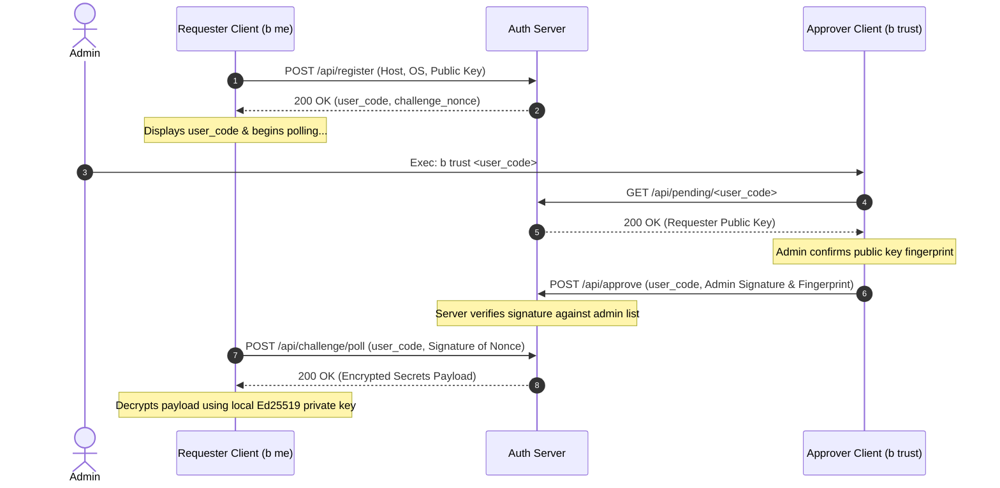

# Client Onboarding & Secrets Provisioning

This wiki page describes the design, cryptography, and protocol flow of the **Bootstrap Client Onboarding and Secrets Provisioning System**. It explains how a new client device establishes secure trust with an authentication server through an existing administrator device.

---

## Overview & Architecture

The onboarding process leverages public-key cryptography to securely distribute configurations or secrets (encrypted using `age`) to newly registered nodes.

The trust model consists of three entities:
1. **Requester Node (New Client)**: An unprovisioned machine requesting configuration secrets. It generates a local Ed25519 key pair for identification.
2. **Approver Node (Administrator)**: A trusted administrator machine that already possesses an approved Ed25519 private key.
3. **Authentication Server**: The central coordinator that manages pending requests, validates administrator signatures, and serves `age`-encrypted payloads. The backend server codebase is hosted in the [bootstrap-auth-server](https://github.com/sortedcord/bootstrap-auth-server) repository.



---

## Cryptographic Mechanics

To maintain security without complex dependencies, the system uses native Unix tools:

* **Authentication (Ed25519)**: SSH Ed25519 key pairs generated by `ssh-keygen` are used for signing. Payloads are signed using `ssh-keygen -Y sign` with a fixed namespace of `bootstrap`.
* **Encryption (`age`)**: Payloads are encrypted specifically to the requester's SSH Ed25519 public key. The client decrypts the payload using its private key:
  ```bash
  age -d -i ~/.config/bootstrap-client/id_ed25519
  ```

---

## Step-by-Step Protocol Flow

### Phase 1: Administrator Registration
The server registers administrator public keys at startup (e.g., via the `ADMIN_PUBLIC_KEY` environment variable). The administrator client on the admin machine must be configured to use the corresponding private key.

### Phase 2: Client Request (`b me`)
1. The requester executes `b me`.
2. It generates an Ed25519 key pair (`id_ed25519`/`id_ed25519.pub`) in `~/.config/bootstrap-client/`.
3. It sends a registration request to the server containing its hostname, OS, and public key.
4. The server registers the device as `pending`, generating a short, human-readable `user_code` and a `challenge_nonce`.
5. The requester displays the `user_code` and begins polling `/api/challenge/poll`.

### Phase 3: Administrator Approval (`b trust`)
1. The operator reads the `user_code` from the requester's terminal and enters it on the administrator device: `b trust <user_code>`.
2. The administrator client fetches the pending public key from `/api/pending/<user_code>`.
3. The operator validates the public key fingerprint.
4. The administrator client signs the requester's public key using `ssh-keygen -Y sign` and submits the signature along with its fingerprint to `/api/approve`.
5. The server validates the signature. If valid, the client state transitions to `approved`.

### Phase 4: Secrets Retrieval & Decryption
1. During its next poll, the requester client signs the `challenge_nonce` and submits it to `/api/challenge/poll`.
2. The server verifies the signature. Since the client is now approved, it returns the secrets payload (which was encrypted with the requester's public key using `age`).
3. The requester client base64-decodes the payload, decrypts it using its local SSH private key, and saves it to `~/.config/bootstrap-client/secrets.decrypted`.

---

## API Reference

### Register Device
* **Endpoint**: `POST /api/register`
* **Content-Type**: `application/json`
* **Request**:
  ```json
  {
    "hostname": "my-client-hostname",
    "os": "Linux",
    "public_key": "ssh-ed25519 AAAAC3NzaC1lZDI1NTE5..."
  }
  ```
* **Response (200 OK)**:
  ```json
  {
    "user_code": "G4J2N3",
    "challenge_nonce": "a6f8b9...",
    "expires_in": 300
  }
  ```

### Get Pending Details
* **Endpoint**: `GET /api/pending/<user_code>`
* **Response (200 OK)**:
  ```json
  {
    "public_key": "ssh-ed25519 AAAAC3NzaC1lZDI1NTE5..."
  }
  ```

### Approve Device
* **Endpoint**: `POST /api/approve`
* **Content-Type**: `application/json`
* **Request**:
  ```json
  {
    "user_code": "G4J2N3",
    "approver_public_key_fingerprint": "SHA256:...",
    "signature": "base64-encoded-sshsig-blob"
  }
  ```
  > [!NOTE]
  > The `signature` is the base64-encoded binary content of the SSHSIG file (i.e. the raw base64 string inside the armor, excluding the `-----BEGIN/END SSH SIGNATURE-----` lines).

### Poll Challenge
* **Endpoint**: `POST /api/challenge/poll`
* **Content-Type**: `application/json`
* **Request**:
  ```json
  {
    "user_code": "G4J2N3",
    "signature": "base64-encoded-sshsig-blob-of-challenge-nonce"
  }
  ```
* **Response (200 OK)**:
  ```json
  {
    "encrypted_secrets": "base64-encoded-age-encrypted-payload"
  }
  ```

---

## Client Usage Guide

### Requirements
Ensure `ssh-keygen`, `curl`, `jq`, and `age` are installed. (The Bootstrap `auth` plugin resolves these automatically on start).

### 1. Requesting Access (`b me`)
Run the following on the client machine to initiate registration:
```bash
b me [--server <server_url>] [--key-dir <dir>] [--poll-interval <seconds>]
```
* Default `--server`: `https://b.adityagupta.dev/auth`
* Default `--key-dir`: `~/.config/bootstrap-client`
* Default `--poll-interval`: `5`

### 2. Approving Access (`b trust`)
Run the following on the administrator machine to approve a pending request:
```bash
b trust <user_code> [--server <server_url>] [--admin-key <path_to_admin_private_key>]
```
* Default `--admin-key`: `~/.ssh/id_ed25519`
